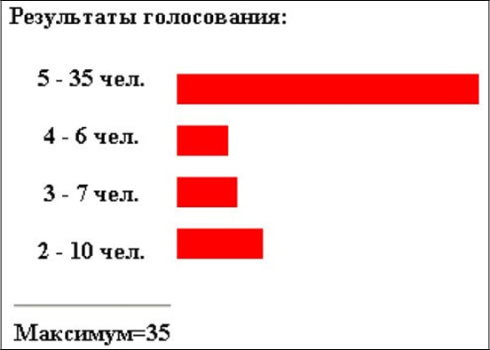

# Практическая работа 3
## Задание № 2. 

Создать программу для проведения опроса – голосования по оценке какого-то товара или мероприятия. Создать форму для голосования с вопросом "Как вы оцениваете наш магазин?" и вариантами ответов в виде `radio-button`.


Подготовить текст программы, обеспечивающей следующие действия. По нажатию кнопки "проголосовать" нужно в соответствии с выбранной оценкой:

* открыть необходимый файл;

* прочитать записанное в файле число;

* увеличить его на единицу;

* и перезаписать результат в этот же файл. Вывести результаты голосования.


Протестировать работу программы не менее десяти раз, просмотреть содержимое файлов.

Модифицировать	программу так, чтобы результаты голосования выводились в виде диаграммы.



Создать два вспомогательных файла. Первый должен обеспечивать создание текстовых файлов 2.txt, 3.txt,4.txt, 5.txt и запись в них числа 0. Второй – удаление этих файлов. Произвести несколько раз тестирование процесса голосования.

_Рекомендации по составлению программы_

1.	Создать файлы для хранения информации: 5.txt, 4.txt, 3.txt и 2.txt с первоначальным значением 0 в каждом файле. В дальнейшем в них будут записываться значения счетчиков ответов при голосовании.
 
2.	Написать фрагмент программы, обеспечивающий вывод формы. Значения параметров поля формы указать цифрой (5, 4, 3, 2), совпадающей с именем файла. Например, для первой строки формы с отметкой отлично поле формы может выглядеть так:
```php
<input type="radio" name="vote" value="5" checked > отлично<br>
```
Заметим, что только это поле "отмечено" (checked), чтобы стимулировать принятие пользователем желаемого решения.
3.	Составить программу обработки переданных данных (например, методом POST). Ниже приведен фрагмент программы для реализации обработки файлов (чтения и записи нового значения) :
```php
if (@$_POST['vote'])
{
// если параметр vote передаётся методом POST, значит нажата кнопка проголосовать
$file=$_POST['vote'].".txt";
// в переменной vote содержится число 2, 3, 4, или 5. Наши файлы имеют такие же
// названия, значит мы можем использовать эти значения длявыбора файла,
// сформировав таким образом его имя
$f=fopen($file,"r");
// открываем файл для чтения
$votes=fread($f,100);
// записываем в переменную $votes старое количество голосов fclose($f);
// закрываем файл
$votes++;
// увеличиваем на единицу количество голосов
$f=fopen($file,"w");
// открываем файл для записи
fwrite($f,$votes);
// записываем в файл новое количество голосов
fclose($f);
// закрываем файл
```
3.	Дописать фрагмент программы для считывания информации из каждого файла и вывода результата.
4.	Для вывода диаграммы можно воспользоваться тэгом горизонтальной линии `<hr>` с параметрами. Например:
```php
?>
<hr align="left" color="#FF0000" size="20" width="<?=$vline?>">
<? Программный код
```
Значение параметра width, отвечающего за ширину линии, здесь заданы фрагментом php- скрипта – упрощенная форма вывода переменной. Само значение переменной `$vline` должно быть связано с переменной $votes масштабным коэффициентом, который следует подобрать самостоятельно.

## Задание № 3. 

Реализовать приложение для работы с телефонным справочником, данные которого хранятся в текстовом файле. Предусмотреть возможность сохранения нескольких номеров телефона для одного абонента.
 
## Задание № 4. 

Реализовать приложение для проверки доступности сервера, адрес которого введен пользователем в форму.

## Задание № 5. 

Реализовать приложение для получения и отображения информации, полученной с удаленного сервера (например, прогноза погоды, ленты заголовков новостей).

## Задание № 6. 

Реализовать приложение-файло-обменник, позволяющее посетителям страницы загружать фай-лы, пока не исчерпан указанный в настройках приложения об-щий дисковый лимит, а также просматривать список всех за-груженных файлов и удалять их. Предусмотреть список разрешенных типов файлов.
