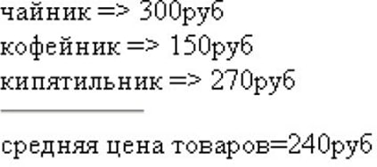
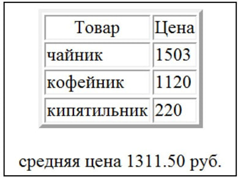
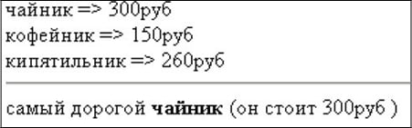

# Практическая работа 1
## Задание № 1. 

Изучить конструкции языка PHP, операторы присваивания, операторы вывода. Подготовить в Блокноте или в любом текстовом редакторе программу, выполняющую следующие действия:

•создать три переменные с названием товаров ($product1, $product2, $product3) и соответствующие им переменные с ценой товаров ($price1, $price2, $price3), вывести их на экран;



•рассчитать и вывести среднюю цену товара.
Примерный вид вывода на экран результата работы программы представлен на рисунке.



Протестировать программу с различными значениями переменных.
Оформить вывод данных о товарах в виде таблицы. Например, как показано на рисунке.

Для оформления таблицы поместить тэги таблицы в оператор вывода (echo или print). Новый вариант программы сохранить в файле с другим именем.

Использовать для табличного вывода HTML блоки. Для вывода переменных в тэги необходимо включить фрагменты программы. Сохранить файл.

## Задание № 2. 

Изучить условные инструкции if, else, elseif. Подготовить программу для определения самого дорогого из трех товаров. За основу взять файл из задания 1. Сравнить цены товаров и вывести наименование и цену самого дорогого товара. Сопроводить вывод результата соответствующим сообщением.



Сравнить цену первого товара с ценами второго и третьего товаров. Если она окажется больше сформировать вспомогательную переменную, например $max_prise, равную цене первого товара и $max_ product, равную наименованию первого товара. В противном случае сравнить цены второго и третьего товаров (использовать конструкцию elseif и else) и записать во вспомогательные переменные соответствующие данные. Вывести вспомогательные переменные. Протестировать программу с различными значениями переменных.

Определить товар с минимальной ценой. Решить задачу, методом "вытеснения", используя только конструкцию if. Во вспомогательные переменные $max_prise и $max_ product сразу записать данные о первом товаре. Последовательно сравнить цены второго и третьего товаров со значением, записанным в переменной $max_prise (конструкция if). Если цена окажется меньше значения записанного в переменной $max_prise, переопределить переменные $max_prise и $max_ product. Протестировать программу с различными значениями переменных.

## Задание № 3. 

Изучить материалы о работе с функциями. Оформить решение задачи Задания 2 с помощью функции, определяющей товар с максимальной ценой. Функция должна иметь шесть формальных входных параметров: три переменные, хранящие наименования товаров, и три переменные, задающие их стоимость. Вывод искомых данных производить внутри функции. После описания функции вызвать ее не менее трех раз с различными значениями фактических параметров.

Подготовить файл, обеспечивающий проверку правильности ввода пароля. Действия по проверке пароля должны выполняться с помощью пользовательской функции с одним входным аргументом. Функция должна сравнивать пароль, заданный внутри функции, с паролем, переданный ей через аргумент. Результат сравнения вывести в виде текста: "Пароль верный" или "Ошибка в пароле". Вывод сообщения должен производиться внутри тела функции. Протестировать программу с различными значениями пароля.

Модифицировать программу так, чтобы вызов функции выполнялся в операторе вывода. Например, если имя функции control($p), то ее вызов: print control("1234"). Внутри тела функции использовать инструкцию return.

## Задание № 4. 

Изучить материалы, относящиеся к организации циклов в PHP. Подготовить текст программы для решения следующей задачи. Пусть стоимость товара равна 100 р. в начале текущего года. Процент инфляции в этом году по прогнозам составит 10 %. В последующие годы прогнозируется увеличение процента инфляции на 3,5 % в год. С помощью циклической программы вывести прогнозируемую стоимость товара к концу текущего года и в последующие годы. Прекратить расчеты, как только стоимость товара превысит 150 р. Использовать цикл while.

Решить ту же задачу с помощью цикла for. Вывести прогнозируемую стоимость товара к концу текущего года и в последующие 5 лет. Вывод оформить в виде таблицы ГОД => ЦЕНА => ИНФЛЯЦИЯ. Модифицировать файл для решения следующей задачи. Пусть при достижении стоимости товара 170 р., инфляция начнет снижаться каждый год на 3,5 %. Спрогнозировать стоимость товара через 10 лет.

## Задание № 5. 
Изучить основы работы с массивами. Подготовить текст программы, выполняющей следующие действия:

•	создать список (индексированный массив), состоящий из пяти наименований товаров с помощью функции array();

•	добавить еще не менее двух элементов массива с помощью идентификатора массива;

•	определить количество элементов массив, используя функцию count(), и вывести названия товаров в цикле for.

Протестировать работу программы с различным количеством элементов массива.

Модифицировать программу, добавив сортировку массива в алфавитном порядке наименований товаров (использовать функцию sort). Вывести на экран исходный массив и результат сортировки.
## Задание № 6. 
Подготовить программу для обработки ассоциативного массива. Программа должна обеспечивать следующее:

•	создать ассоциативный массив: ТОВАР => ЦЕНА, где название товара – это ключ (индекс) массива, а цена – значения элементов массива;

•	массив должен содержать не мене пяти элементов, три из них задать с помощью функции array(), а остальные задать непосредственно в операторе присваивания;

•	вывести товары и их цены, используя оператор цикла foreach().
Протестировать работу программы с различным количеством элементов массива, добавив их любым способом.
Модифицировать программу для решения следующих задач:

•	подсчитать количество товаров и их суммарную стоимость;

•	отсортировать массив:

–	в порядке убывания (возрастания) цены товара и вывести на экран. Использовать функции asort() и arsort().

–	выполнить сортировку массива так, чтобы товары (ключи) расположились в алфавитном порядке для чего использовать функции ksort() или krsort().

## Задание № 7. 
Создайте php-скрипт, выводящий страницу с форматированной средствами разметки HTML информацией о вас как о разработчике.
## Задание № 8. 
Создайте php-скрипт, генерирующий страницу с таблицей основных цветов HTML. Указания: интенсивности красного, зеленого и синего цветов принимают шестнадцатеричные значения 00, 33, 66, 99, CC, FF. Для преобразования между деся-тичными и шестнадцатеричными числовыми значениями ис-пользуйте стандартные функции dechex, hexdec.
## 
Задание № 9. Реализуйте скрипт, генерирующий и выводящий в браузер случайные числа до тех пор, пока их сумма не станет больше или равна заданного значения $n. Указание: для генерации псевдослучайного целого числа, принадлежащего диапазону [$min,$max], используйте стандартную функцию rand($min,$max).

# Практическая работа 2

## Задание № 2. 
Подготовить текст программы, выполняющей следующие действия: cоздать html-документ, содержащий форму с полями Ф.И.О., Адрес, Email, Пароль и передать введенные данные для обработки php-программе –для вывода данных на экран.

Протестировать работу программы. Решить ту же задачу, но с помощью одного файла.

Проверить работоспособность программы.

## Задание № 3. 

Подготовить программу для решения аналогичной задачи, но проверяющей пароль пользователя, вводимый через поле формы. Значение правильного пароля задается внутри текста программы. Сохранить текст программы в файле и протестировать ее.

Модифицировать программу так, чтобы в случае ввода правильного пароля, происходил переход на другой файл с текстом поздравления.

## Задание № 4. 

Подготовить файл для отправки электронного письма. Файл должен содержать форму, в которой расположить 4 элемента с соответствующими комментариями:

•	текстовое поле (text) с именем to;

•	текстовое поле (text) с именем subject;

•	текстовую область (textarea) с именем message;

•	кнопка (submit) с именем mail_ok.

Данные из формы передать методом POST скрипту, с функцией отправки сообщения и проверкой правильности отправки письма.

Пояснения к программе отправления электронного письма

Для простоты обработки данных, полученных из формы, назовем соответствующие переменные: $to, $subject и $message. Затем информацию из этих переменных будем использовать для отправки письма на адрес e-mail, указанный в переменной $mail.

Отправка письма производится с помощью функции mail():

```php 
bool mail ( string $to , string $subject , string $message)
```

Функция возвращает значение TRUE если почта отправлена и FALSE в противном случае.  Так как при работе с локальным хостингом оправка письма не производится, проверку правильности передачи письма можно выполнить с помощью оператора If и вывести соответствующее сообщение на экран. 

## Задание № 5. 

Написать программу-калькулятор, которая позволит пользователю передать два числа и указать арифметическую операцию, выполняемую над ними.

## Задание № 6. 

Реализовать ввод и обработку анкеты пользователя. Форма анкеты заполняется на одной странице, скрипт-обработчик, реализованный в отдельном файле, проверяет правильность заполнения всех полей и делает вывод на основе представленной информации (например, вычисляет количество языков программирования, которые знает пользователь, определяет его возраст в годах по введенной дате рождения и т.п.).

## Задание № 7. 

Реализовать тест из 3–4 вопросов с несколькими вариантами ответа на каждый вопрос, предусмотреть начисление баллов за выбранные пользователем варианты ответа. В конце тестирования, в зависимости от количества набранных баллов, вывести резюме по тесту.
